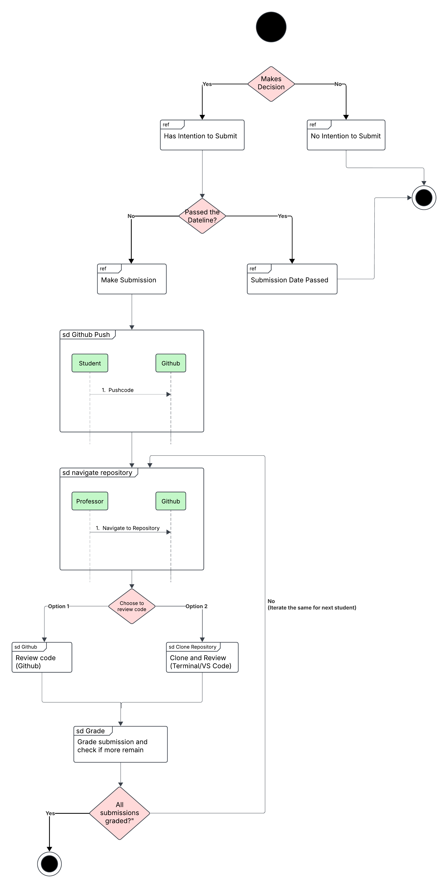
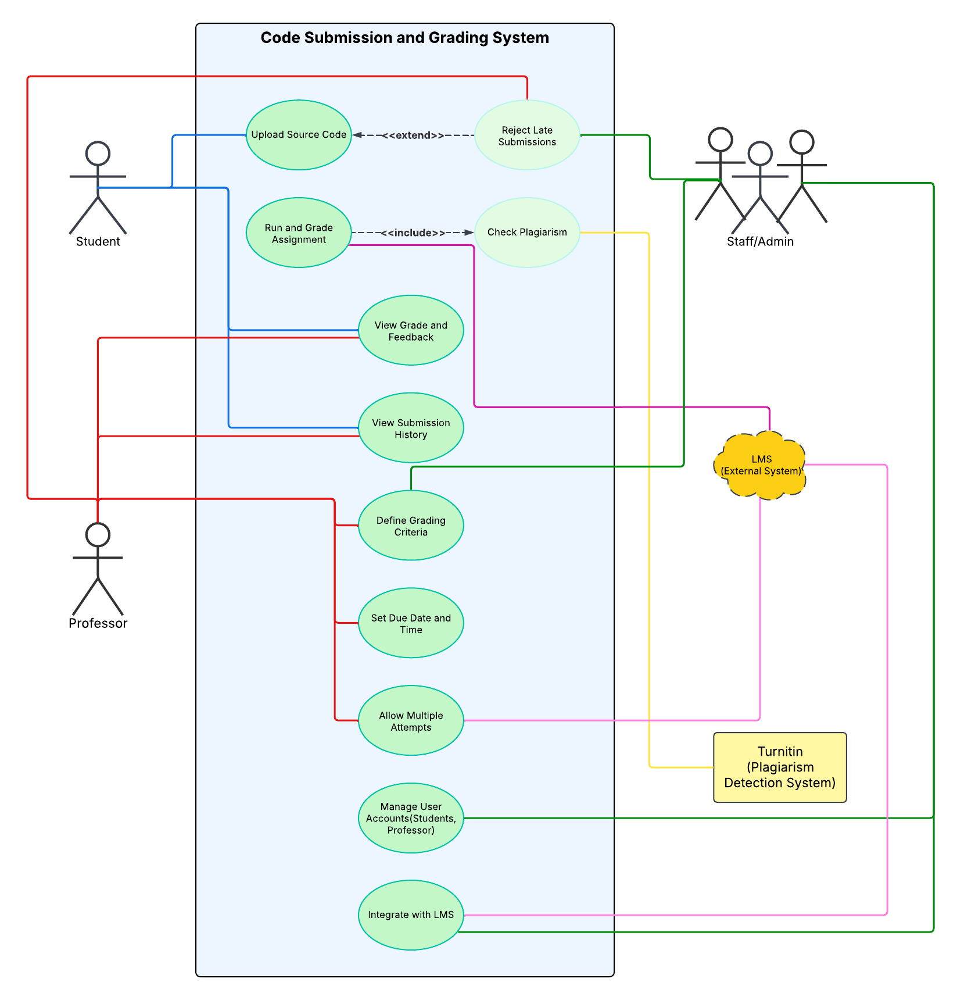
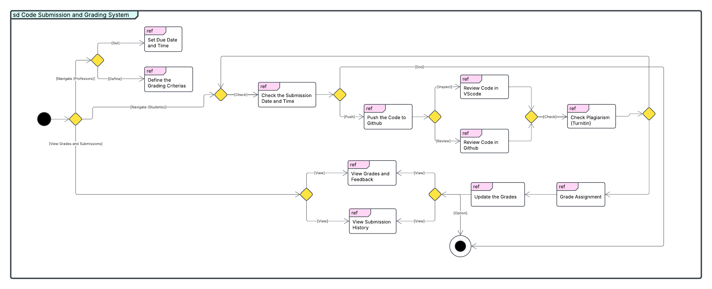

# Practical Report 1: Student-Professor GitHub Submission and Grading Process  

## Introduction  
This report documents the practical work conducted on the Code Submission and Grading System. The system is designed to facilitate students in submitting their code assignments and professors in grading them efficiently. The system integrates with external tools like GitHub for code hosting, Turnitin for plagiarism detection, and LMS for seamless synchronization of grades and feedback. The practical work involved creating Use Case Diagrams (UCD), Interaction Diagrams (IoD), and an Interaction Overview Diagram (IoD) to model the system's functionality and interactions.

---

## Objectives  
The primary objectives of this practical work were:  

- To analyze the requirements of the Code Submission and Grading System.  
- To design and model the system's functionality using UML diagrams.  
- To demonstrate how the system integrates with external tools like GitHub, Turnitin, and LMS.  
- To provide a clear and coherent representation of the system's workflow and interactions.  

---

## Methodology  
The practical work was divided into three main tasks:  

<b>1. Use Case Diagram (UCD)</b>

- Identified the key actors (Student, Professor, Staff/Admin) and their interactions with the system.  
- Included use cases such as:  
  - **Student**: Upload Source Code, View Grade and Feedback, View Submission History.  
  - **Professor**: Run and Grade Assignment, Check Plagiarism, Define Grading Criteria, Set Due Date and Time.  
  - **Staff/Admin**: Manage User Accounts, Integrate with LMS.  
- Relationships:  
  - `<extend>`: Reject Late Submissions extends Upload Source Code.  
  - `<include>`: Check Plagiarism is included in Run and Grade Assignment.  

<b>2. Interaction Diagram (IoD)</b>

- Focused on the flow of interactions between the Student and Professor during the submission and grading process.  
- Key interactions included:  
  - **Student**: Checks submission date, pushes code to GitHub.  
  - **Professor**: Navigates to the student's repository, reviews code (directly on GitHub or by cloning the repository), grades the submission, and checks for plagiarism using Turnitin.  
- Decision Points:  
  - If the submission date has passed, the system rejects the submission.  
  - If all submissions are graded, the process ends; otherwise, the professor proceeds to the next student.  

<b>3. Interaction Overview Diagram (IoD)</b>

- Combined elements from the UCD and IoD to provide a high-level view of the system's functionality.  
- Key components included:  
  - **Icons**: Represented actions such as uploading code, reviewing code, and grading submissions.  
  - **Actors**: Student, Professor, Staff/Admin.  
  - **External Systems**: GitHub, LMS, and Turnitin.  
  - **Flow**: Showed how the actors interact with the system and external tools to achieve the desired outcomes.  

---

## System Overview  

<b>2.1 Interaction Diagram (IoD)</b>

The Interaction Diagram detailed the sequence of interactions between the Student and Professor. Key interactions included:  

- **Student**: Checks submission date, pushes code to GitHub.  
- **Professor**: Navigates to the student's repository, reviews code (directly on GitHub or by cloning the repository), grades the submission, and checks for plagiarism using Turnitin.  
- **Decision Points**:  
  - If the submission date has passed, the system rejects the submission.  
  - If all submissions are graded, the process ends; otherwise, the professor proceeds to the next student.  

  
*Figure 1: Interaction Diagram for the Code Submission and Grading System.*

<b>2.2 Use Case Diagram (UCD)</b>

The Use Case Diagram provided a high-level overview of the system's functionality. Key components included:  

- **Actors**: Student, Professor, Staff/Admin, LMS, and Turnitin.  
- **Use Cases**:  
  - **Student**: Upload Source Code, View Grade and Feedback, View Submission History.  
  - **Professor**: Run and Grade Assignment, Check Plagiarism, Define Grading Criteria, Set Due Date and Time.  
  - **Staff/Admin**: Manage User Accounts, Integrate with LMS.  
- **Relationships**:  
  - `<extend>`: Reject Late Submissions extends Upload Source Code.  
  - `<include>`: Check Plagiarism is included in Run and Grade Assignment.  

  
*Figure 2: Use Case Diagram for the Code Submission and Grading System.*

<b>2.3 Interaction Overview Diagram (IoD)</b>

The Interaction Overview Diagram provided a visual representation of the system's workflow. Key components included:  

- **Icons**: Represented actions such as uploading code, reviewing code, and grading submissions.  
- **Actors**: Student, Professor, Staff/Admin.  
- **External Systems**: GitHub, LMS, and Turnitin.  
- **Flow**: Showed how the actors interact with the system and external tools to achieve the desired outcomes.  

  
*Figure 3: Interaction Overview Diagram for the Code Submission and Grading System.*

---

## Conclusion  
The practical work on the Code Submission and Grading System was successfully completed, with the creation of a Use Case Diagram, Interaction Diagram, and Interaction Overview Diagram. The diagrams effectively model the system's functionality and interactions, providing a solid foundation for further development. The work demonstrates a strong understanding of system design principles and the importance of integrating with external tools to enhance functionality.  

---

