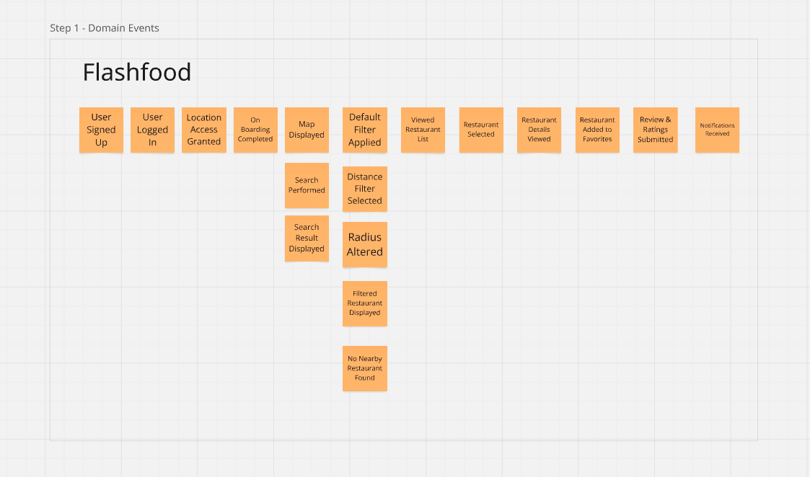
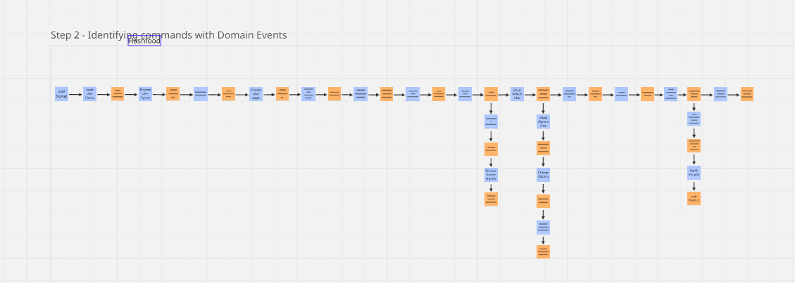
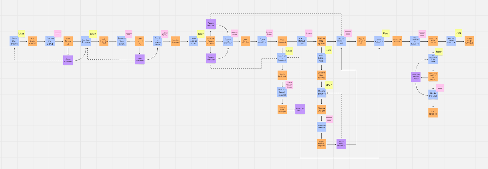
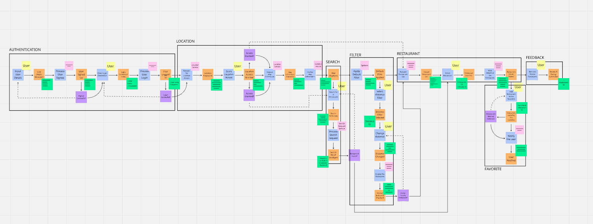
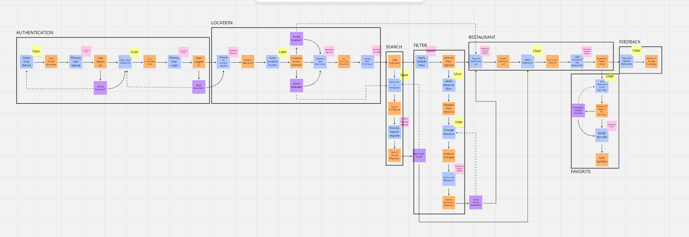

# Practical 3: Event Storming Diagram for Flashfood
[Link for miro to have a better quality of the Event Storming](https://miro.com/app/board/uXjVISl79uY=/?share_link_id=801518879943)

## Introduction
Flashfood is a web application designed to help users discover nearby restaurants based on their current location or a specified location. The app provides features such as searching for restaurants, displaying menus with prices, showing restaurant status (open/closed), and allowing users to favorite restaurants for quick access. This report outlines the Event Storming process used to model the complex business processes and domain events involved in the Flashfood application.

---

## What is Event Storming?
Event Storming is a collaborative workshop technique used to explore and model complex business processes and domains. It facilitates a shared understanding among stakeholders and developers, leading to better design and implementation decisions. The process involves identifying domain events, commands, actors, policies, and schemas to create a comprehensive workflow.

---

## Steps Followed for Event Storming

### Step 1: Collecting Domain Events
Domain events are key occurrences in the system that represent significant changes or actions. These events are written in the past tense. For Flashfood, some of the identified domain events include:
- User signed up
- Notification sent
- Menu updated
- Location accessed
- Restaurant added to favorite

**Snapshot of Domain Events:**

---

### Step 2: Sequencing and Identifying Commands
Commands are actions that trigger domain events. They are written in the present tense and represent the instructions given by actors or the system. Examples of commands for Flashfood include:
- User sign-in
- Process location access
- Process search
- Notify user

**Snapshot of Commands:**

---

### Step 3: Labeling Commands Triggered by Actors/System
Each command is associated with an actor or system component that triggers it. For Flashfood, the actors and systems include:
- User
- Location service
- Authentication service
- Notification service
- System

**Snapshot of Labeled Commands:**

---

### Step 4: Identifying Policies
Policies are predefined rules that determine the next steps after a domain event occurs. They often involve validation or decision-making processes. For example:
- If a user fails to sign up, the policy might require the user to try again.
- If a restaurant is closed, the policy might notify the user to choose another option.

**Snapshot of Policies:**

---

### Step 5: Identifying Artefacts & Schema
Schemas define the structure of data associated with each domain event. For example, the domain event "Location Accessed" might have the following schema:

| **Field**       | **Data Type** |
|------------------|---------------|
| UserID           | INT           |
| Latitude         | FLOAT         |
| Longitude        | FLOAT         |
| RestaurantID     | INT           |

**Snapshot of Schemas:**

---

### Step 6: Bounding the Context
After identifying the events, commands, and policies, the next step is to group them into bounded contexts. Each bounded context represents a specific domain or service within the application. For Flashfood, the bounded contexts include:

1. **Authentication Domain:**
   - Handles user sign-up and login processes.

2. **Location Domain:**
   - Manages access to the user's precise location and calculates distances to restaurants.

3. **Search Domain:**
   - Handles the search functionality for restaurants by name or location.

4. **Filter Domain:**
   - Manages the application of filters (e.g., distance, ratings) and sorting options.

5. **Restaurant Domain:**
   - Manages restaurant details, menus, and status (open/closed).

6. **Feedback Domain:**
   - Handles user reviews, ratings, and feedback submissions.

7. **Favorites Domain:**
   - Manages the user's favorite restaurants for quick access.

By bounding the context, we ensure that each domain is self-contained and serves a specific purpose, making the system modular and easier to maintain.

**Snapshot of Bounded Context:**

---

## Key Features of Flashfood
1. **Onboarding and Initial Setup:**
   - Welcome screen with app purpose and a appealing logo.
   - Location access prompt.
   - User registration/login via email or phone number.

2. **Home Screen:**
   - Restaurant listings based on location.
   - Search bar for specific restaurants.
   - Filters and sorting options (e.g., distance, ratings).

3. **Restaurant Details:**
   - Overview (name, rating, distance, description).
   - Item details (description, ingredients, prices).
   - User reviews and ratings.

4. **User Interaction:**
   - Add restaurants to favorites.
   - Leave reviews and ratings.

5. **Search and Discovery:**
   - Fast search functionality (by name).
   - Discover section for trending and recommended restaurants.

6. **Notifications and Alerts:**
   - Push notifications for new restaurants, offers, and updates.
   - Alerts for changes in restaurant status (e.g., opening hours, events).

---

## Conclusion
The Event Storming process for Flashfood has successfully identified the key domain events, commands, actors, policies, and schemas required to build a robust and user-friendly restaurant discovery application. By following this structured approach, stakeholders and developers can ensure a shared understanding of the system, leading to better design and implementation decisions. Th[Link Text](URL)e bounded contexts further modularize the system, making it scalable and maintainable.

---

